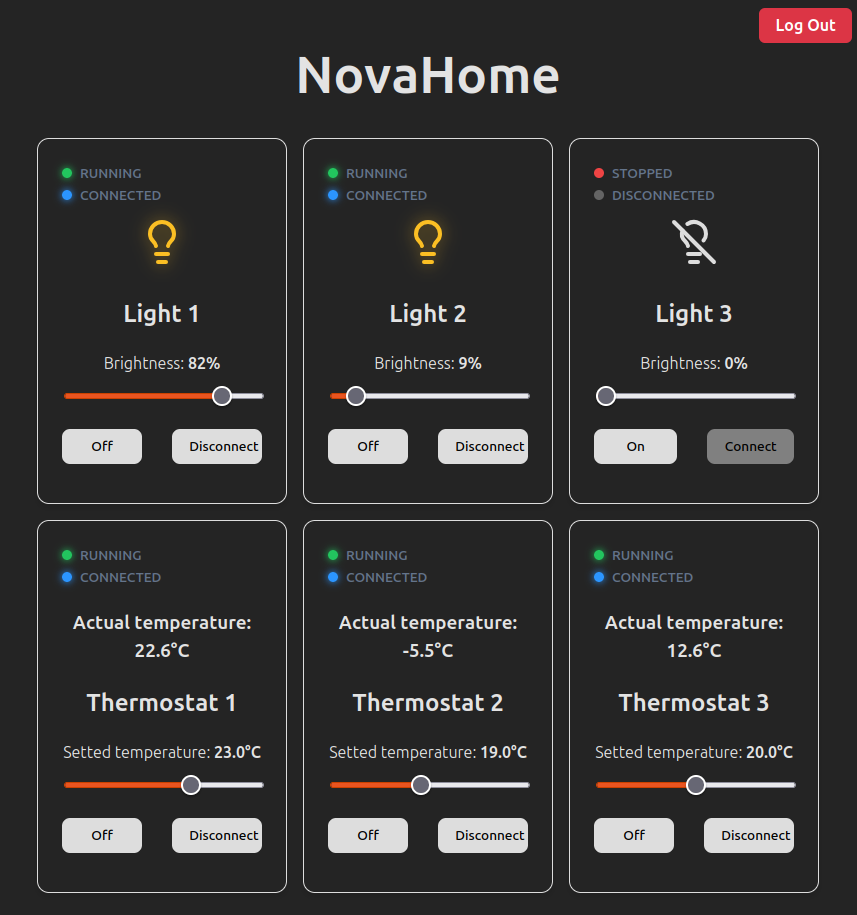
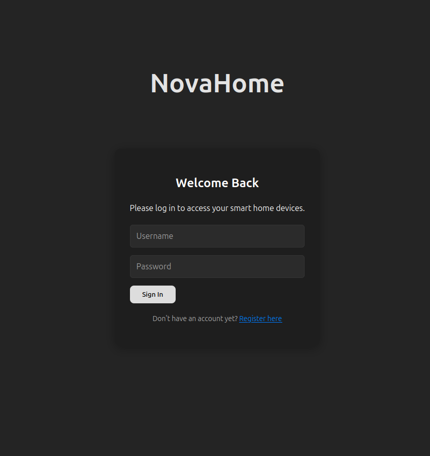
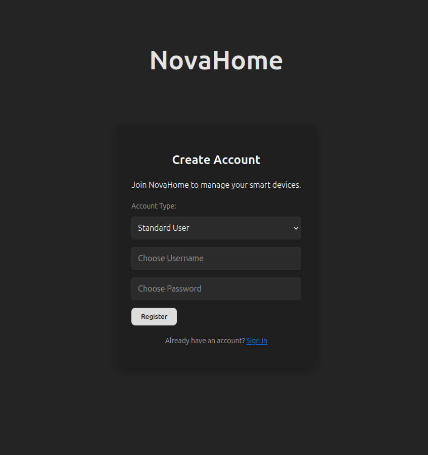

# NovaHome

NovaHome is a full-stack web application featuring a Java backend coupled with a React frontend. This repository is organized as a unified monorepo, housing both service layers within a single, streamlined workspace.

The purposes of building NovaHome was to design a simulation of Smart Home control system. 

## About the project

Application simulates functionalities of control sample Smart Home devices such us: **lights, thermostats**.

Each devices got their ***powerOn status*** and ***connectivity status*** (which represents Wifi connection). To control device, it has to be ***either turned on or connected***.

User is able to change the brightness level or each lights separately. The thermostat objects allows to set the temperature. To fullfiled the simulation aspect, the actual temperature desire the setted one. The regulation loop is designed as a simple P-type regulator. 




Application has its own user authentication layer. ***To operate at the dashboard, user is forced to log into the system***. This is the default page when launching.




To create a new account, click in the hyperlink.



All personal data are being stored in the local database.

##  Project Architecture

```text
novahome/
├── backend/     # Java / Maven Backend (REST API)
└── frontend/    # React Frontend UI
```

## Installation & Local setup

📋 Prerequisites

Ensure you have the following installed on your machine:

    Java Development Kit (JDK): Version 17 or higher

    Apache Maven: Build automation tool for Java

    Node.js & npm: Node runtime (LTS recommended)

    Database: MySQL / PostgreSQL (Update properties accordingly)


###     1. Backend Setup 
Navigate to the backend directory:
```
cd backend
```

Open ***src/main/resources/application.properties*** and update the database credentials to match your local setup:

```
spring.datasource.url=jdbc:mysql://localhost:3306/YOUR_DATABASE_NAME
spring.datasource.username=YOUR_USERNAME
spring.datasource.password=YOUR_PASSWORD
```

then compile and launch the application using Maven:
```
mvn clean spring-boot:run
```

###     2. Frontend Setup
Navigate to the frontend directory:
```
cd frontend
```

Install the necessary node module dependencies:
```
npm install
```

Launch the local development server:
```
npm start
```

## Built With
Backend: Java, Spring Boot, Maven

Frontend: React.js, JavaScript, HTML5, CSS3, npm

Version Control: Git, GitHub Monorepo architecture